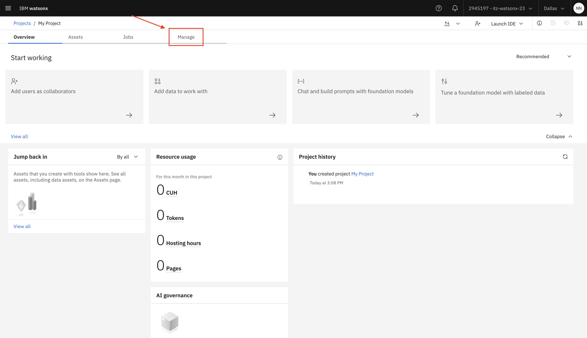

# IBM watsonx.ai Platform Setup

## How to Access Your IBM Cloud Account

You can access IBM Cloud using the credentials provided for you. Navigate to the environment number assigned to you and use the corresponding credentials.

| env # | URL                                          | Username    | Password        | Access Group / Cloud Service ID    | IBM Cloud Service API Key                                |
|-------|----------------------------------------------|-------------|-----------------|-----------------------------------|--------------------------------------------------------|
| 0     | https://cloud.ibm.com/authorize/itzwatsonx23 | student_****** | 8tc2j5pmp****** | txv-itz-******           | ********           |

1. Navigate to the `URL`

2. Enter the `Username` and `Password` provided, and click Sign in.

## How to get to the watsonx.ai platform?

1. Once you've logged in to the Cloud account using your credentials, click the hamburger (☰) menu in the top-left corner to launch the IBM watsonx.ai Platform.

2. Welcome to the IBM watsonx Platform. Here you can find links to the documentations and `Launch` the services.

3. Click the the `Launch` button underneath the `watsonx.ai` service. This will take you to the watsonx.ai landing page. Optionally, you may take a tour of the Platform to explore its capabilities or close the dialog box to skip it.

## Create a Project on a watsonx.ai

1. Next, we need to create a Project for the Lab. On the IBM watsonx.ai home page, click the hamburger (☰) menu in the top-left corner.

2. Within the sidebar menu, expand `Projects` and select `View all projects`.

3. On the right side of the Projects page, select the "New project" button.

4. Select "Create an empty project"

5. Fill the project "Name" field. Optionally, fill the "Description" field. Then at the bottom right, press the "Create project" button.

6. Your project should be successfully created.

## Associate the watsonx.ai Runtime service

For some types of assets, we must associate the `watsonx.ai Runtime` service with the project. You will be prompted to associate the watsonx.ai Runtime the first time you open tools like Prompt Lab, AutoAI, SPSS Modeler, and Decision Optimization.

Let's go ahead and do that.

1. Go to the project's `Manage` tab and select the `Services and integrations` page.

2. In the IBM Services section, click Associate Service.

3. Select your IBM watsonx.ai Runtime service instance and click Associate.

## Enable your API Key

1. Next we need to enable the use of API Key. Go to the `Manage` tab, and select `Access control`. Click the `Add Collaborators` button and select `Add Access Group`.

2. Click the `Add Collaborators` button and select `Add Access Group`.

3. Enter the `Access Group` name provided in your credentials (Access Group / Cloud Service ID).

4. Search for the Service ID and click `Add` to import it with the `Admin` role.

5. Now you have successfully enabled the provided API Key and can use it in your application.