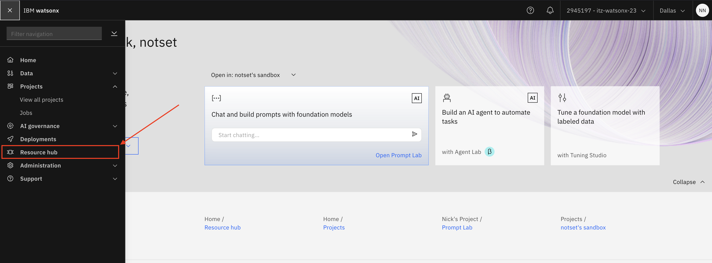
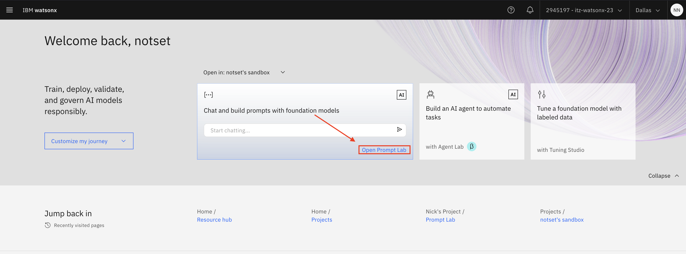

# Prompt a foundation model using Prompt Lab

In this Lab you will learn how to use the **Prompt Lab** in **watsonx.ai**. There are usually multiple ways to prompt a foundation model for a successful result. In the Prompt Lab, you can experiment with prompting different foundation models, explore sample prompts, as well as save and share your best prompts.

**Required services**:
- watsonx.ai Studio
- watsonx.ai Runtime

**Your basic workflow includes these tasks**:

1. **Open a project**. Projects are where you can collaborate with others to work with data.
2. **Open the Prompt Lab**. The Prompt Lab lets you experiment with prompting different foundation models, explore sample prompts, as well as save and share your best prompts. [Read more about Prompt Lab](https://dataplatform.cloud.ibm.com/docs/content/wsj/analyze-data/fm-prompt-lab.html?context=wx).
3. **Select the model to use**. You can submit your prompt to any of the models avaible in watsonx.ai.
4. **Type your prompt in the prompt editor**. You can type prompts in either freeform and structured mode.
5. **Save your work as a projet asset**. Saving your work as a project asset makes your work available to collaborators in the current project.

## Before you get started - check out the Resource Hub

In the Resource Hub you can explore sample projects to help you get started and you can read more about the available foundation model to work with.

Foundation models are very large AI models. They have billions of parameters and are trained on terabytes of data. Foundation models can perform a variety of tasks, including text-generation, code-generation, or image-generation, classification, conversation, and more. Large language Models (LLMs) are a subset of foundation models used for text and code-related tasks.

Check out the [Foundation Model Library](https://dataplatform.cloud.ibm.com/samples?context=wx&tab=foundation-model) where you can explore foundation models from IBM and other third-parties depending on your use case.




## Prompt Lab Overview

One the landing page of Prompt Lab you will see:


There are 3 modes to select from, **Chat mode** to chat with the foundation model to see how the model handles dialog or question-answering tasks. **Structured mode** to help you experiment and create effective prompts - the text from the fields is sent to the model in a template format. And the **Freeform mode** where you add your prompt in plain text and your prompt text is sent to the model exactly as you typed it.

On the left panel you will see *Sample Prompts* from various domains and use-cases to help you get started and familiar with prompt engineering best practices. Your *Saved Prompts* templates and *History* for future reference.

**Sample Prompts**


**Saved Prompts**


**Session History**


# Tasks in this Lab: Overview

- **Task 1**: Use the Prompt Lab in Structured mode
- **Task 2**: Use the Prompt Lab in Freeform mode
- **Task 3**: Use the sample prompts
- **Task 4**: Adjust foundation model and model parameters
- **Task 5**: Save your work

## Task 1: Use the Prompt Lab in Structured mode
You can type your prompt in a structured format. The structured format is helpful for few-shot prompting, when your prompt has multiple examples. Follow these steps to use the Prompt Lab in Structured mode:

1. From the home screen, click the **Open in Prompt Lab** tile.

2. If promopted for an acknowledgement or a tour - select each checkbox to accept the terms, and then click **Skip tour**.
3. Click the **Structured** tab to prompt a foundation model in *Structured* mode.
4. Switch the Foundation Model to `flan-t5-xxl-11b` from the top-right drop-down.
5. In the *Instruction* field, copy and paste the following text:
```
Given a message submitted to a customer-support chatbot for a cloud software company, classify the customer's message as either a question or a problem description so the chat can be routed to the correct support team.
```
6. In the *Example* fields, copy and paste the following text in each column:


| **Input**        | **Output** |
|-----------------|-------------------|
| When I try to log in, I get an error. | Problem |
| Where can I find the plan prices? | Question |
| What is the difference between trial and paygo? | Question | 
| The registration page crashed, and now I can't create a new account. | Problem |

7. In the *Try* field, copy and paste the following text: `I'm having trouble registering for a new account.`
8. Click **Generate** to see the output *Problem*.


## Task 2: Use the Prompt Lab in Freeform mode

You can type your prompt text in a freeform, plain text editor and then click Generate to send your prompt to the model. Follow these steps to use the Prompt Lab in Freeform mode:

1. Click the Freeform tab to prompt a foundation model in Freeform mode.
2. Copy and paste the following text in the text field.
3. Switch the Foundation Model to `mixtral-8x7b-instruct-v01` from the top-right drop-down.

```
Classify this customer message into one of two classes: question (the customer is asking a technical question or a how-to question about our products or services) or problem (the customer is describing a problem they are having. They might say they are trying something, but it's not working. They might say they are getting an error or unexpected results)


customer message: I'm having trouble registering for a new account.
class:
```

4. Click Generate to see the correct output class for the given customer message.


## Task 3: Use the sample prompts

 Follow these steps to use the sample prompts:

1. Open the **Sample prompts** icon to display the list.
2. Scroll through the list, and click the **Marketing email generation** sample prompt.
3. View the selected model. When you load a sample prompt, an appropriate model is selected for you. In this sample use-case, it's `flan-t5-xxl-11b`.
4. Open the **Model Parameters** panel. The appropriate decoding and stopping criteria parameters are set automatically too.
5. Click **Generate** to submit the sample prompt to the model, and see the sample email output.


## Task 4: Adjust foundation model and model parameters
You can experiment with different models and its parameters e.g, decoding methods, repetition pentalty, stopping criteria etc.

> **Note** The model parameters vary based on the currently selected model.

1. Click **Model** > View all *foundation models*.
Click a model to learn more about a model, and see detail such as the model architecture, pretraining data, fine-tuning information, and performance against benchmarks.


The following table defines the model parameters available for the `flan-t5-xxl-11b` foundation model.

| Model Parameter          | Meaning                                                                                                                                                          |
|--------------------------|------------------------------------------------------------------------------------------------------------------------------------------------------------------|
| **Decoding**              | Set decoding to Greedy to always select words with the highest probability. Set decoding to Sampling to customize the variability of word selection.             |
| **Temperature**           | Control the creativity of generated text. Higher values will lead to more randomly generated outputs.                                                           |
| **Top P (nucleus sampling)** | Set to < 1.0 to use only the smallest set of most probable tokens with probabilities that add up to top_p or higher.                                               |
| **Top K**                 | Set the number of highest probability vocabulary tokens to keep for top-k-filtering. Lower values make it less likely the model will go off topic.                |
| **Random seed**           | Control the random sampling of the generated tokens when sampling is enabled. Setting the random seed to the same number for each generation ensures repeatability.|
| **Repetition penalty**    | Set a repetition penalty to counteract the model's tendency to repeat prompt text verbatim or get stuck in a loop. 1.00 indicates no penalty.                    |
| **Stop sequences**        | Set stop sequences to one or more strings to cause the text generation to stop if or when they are produced as part of the output.                              |
| **Min tokens**            | Define the minimum number of tokens to generate. Stop sequences encountered prior to the minimum number of tokens being generated are ignored.                  |
| **Max tokens**            | Define the maximum number of tokens to generate.                                                                                                                |
1. Change the **Top K** parameter to `10` to make it less likely the model will go off topic.
2. Click **X** to delete the previous model output.
3. Click the same sample prompt from the list.
4. Click **Generate** to generate output using the new model parameters.
5. Click the **Session history** icon after submitting multiple prompts to view your session history.
6. Click any entry to work with a previous prompt, model specification, and parameter settings, and then click **Restore**.
7. Edit the prompt, change the model, or adjust decoding and stopping criteria parameters.
8. Click **Generate** to generate output using the updated information.

## Task 5: Save your work

You can save your work in three formats:

| Asset Type      | Description                                          |
|-----------------|------------------------------------------------------|
| **Prompt template** | Save the current prompt only, without its history.  |
| **Prompt session** | Save history and data from the current session.     |
| **Notebook**     | Save the current prompt as a notebook.               |


Follow these steps to save your work:

1. Click **Save work > Save as.**
2. Select the Asset type -> **Prompt template.**
3. For the name, type `Sample prompts`.
4. Select the **View in project after saving** option.
5. Click **Save**.
6. On the project's *Assets* tab, click the **Sample prompts** asset to load that prompt in the Prompt Lab and get right back to work.
7. Click the **Saved prompts** to see saved prompt from your sandbox project.


