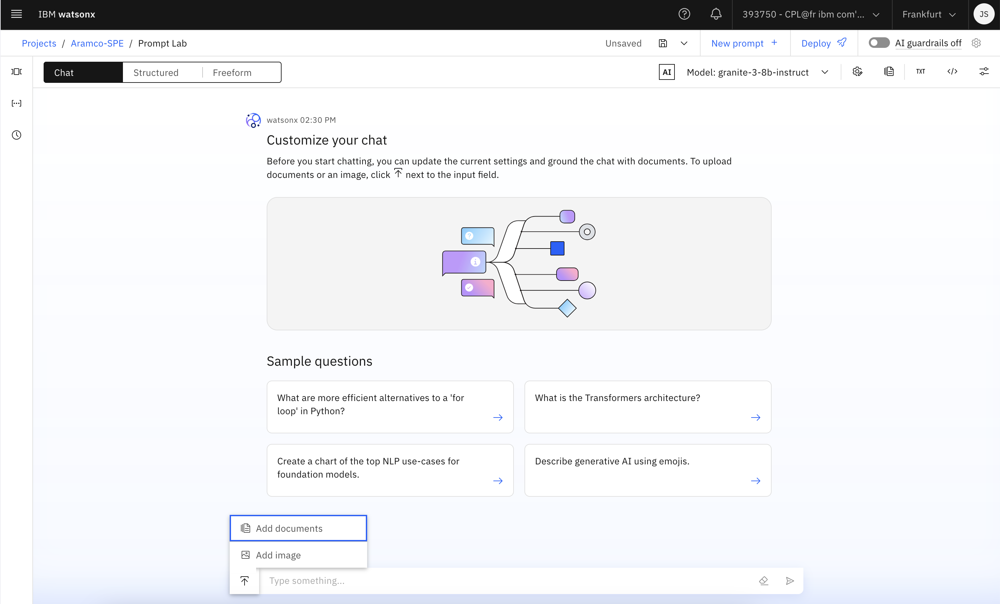

# Chatting with documents and images

In this Lab you will learn how to chat with documents and images using the **Grounding with Documents** feature in **watsonx.ai**. You will see how to quickly add documents and images to chat about to foundation model prompts that you create in the Prompt Lab.

### Grounding documents

If you want a foundation model to incorporate current, factual information in the output that it generates; you must ground the foundation model input in relevant facts by associating documents with the prompt.

This pattern, which is known as **retrieval-augmented generation (RAG)**, is especially helpful in question-answering scenarios where you want the foundation model to generate accurate answers.

## The retrieval-augmented generation pattern

Foundation models can generate output that is factually inaccurate for various reasons. One way to improve the accuracy of generated output is to provide the necessary facts as context in your prompt text.

For example, the following prompt includes context to establish some facts:

> **Context**: Maha recently painted the kitchen yellow, which is her favorite color. \
> Maha's favorite color is... 

Unless Maha is a famous person whose favorite color was mentioned in many online articles that are included in common pretraining data sets, without the context at the beginning of the prompt, no foundation model can reliably generate the correct completion of the sentence at the end of the prompt. Hence, if you prompt a model with text that includes fact-filled context, then the output the model generates is more likely to be accurate.

You can scale out the technique of including context in your prompts by using information in a knowledge base. The following diagram illustrates the retrieval-augmented generation pattern. Although the diagram shows a question-answering example, the same workflow supports other use cases.

**The retrieval-augmented generation pattern involves the following steps:**

1. Search in your **knowledge base** for content that is related to a user's question.
2. Pull the most relevant **search results into your prompt as context** and add an instruction, such as “*Answer the following question by using only information from the following passages.*”
3. Send the combined prompt text **(instruction + search results + question)** to the foundation model.
4. The foundation model uses contextual information from the prompt to generate a factual answer.

For more details, see [Generating factually accurate outputs](https://dataplatform.cloud.ibm.com/docs/content/wsj/analyze-data/fm-factual-accuracy.html?context=wx)

## Chatting with uploaded documents

To quickly test your use case and foundation model, you can use watsonx.ai **Prompt Lab** to chat with the document:

1. Navigate to the IBM watsonx.ai Homepage and select Prompt Lab.

2. From the Prompt Lab select the **Chat mode**, select a foundation model, and then specify any model parameters that you want to use for prompting.

3. Click the **Upload documents** icon, and then choose **Add documents**.

4. Select the **In memory** vector store, and **upload** your document and give it a name

5. Click **Create**.

6. Chat with **document** and submit questions about information from the document to see how well the model can use the contextual information to answer your questions. For example, you can ask the foundation model to summarize the document or ask about concepts that are explained in the document. If answers that you expect to be returned are not found, you can review the configuration under **Advanced settings** and make adjustments.

**Note** : *The supported file types are sizes limitations are as follows:*

| **Supported file type** | **Maximum total file size** |
|----|----|
| DOCX | 10 MB |
| PDF | 50 MB |
| PPTX| 300 MB | 
| TXT | 5 MB |

You can add one or more files to your prompt. The total file size that is allowed for the set of grounding documents varies based on the file types in the set. The file type with the lowest total file size allowed determines the size limit for all of the grounding documents. For example, if the set includes three PPTX files, then the file size limit is 300 MB, which is the maximum size allowed for PPTX files. If the set of files includes two PPTX files and one TXT file, then the file size limit is 5 MB because the limit for TXT files is applied to the set.

### Grounding images

You might want to add an image and convert the visual information into text to help with the following types of tasks:
- Automate the generation of alternative text for images to help blind users to perceive meaningful visuals on a web page and meet accessibility requirements
- Summarize photos of property damage that accompany insurance claims
- Convert images from a document into text before the document is used as grounding information for a RAG use case.

## Chatting with uploaded images

Select a **multimodal foundation model** and upload an image to add to the input. After you add the image, you can ask questions about the image content.

1. From the Prompt Lab select the **Chat** mode, select a **multimodal foundation model** that can convert images to text e.g., `llama-3-2-90b-vision-instruct`, and then specify any model parameters that you want to use for prompting.

2. Click the **Upload documents** icon, and then choose **Add image**. Browse to upload an image file or choose a data asset in your project with the image file that you want to add.

3. Click **Add**.

4. Enter a question about the image, and then submit the prompt. Be specific about what you want to know about the image.

5. Optional: Save the prompt as a prompt template or prompt session.

**Note** : *You cannot save a chat with an added image as a prompt notebook.*

The image requirements are as follows:
- Add one image per chat
- Supported file types are PNG or JPEG
- Size can be up to 4 MM
- One image is counted as approximately 1,200–3,000 tokens depending on the image size

### Prompting the `meta/llama 3.2 90B` vision model

To illustrate how the instruction that you give in text affects the quality of the foundation model output. We submitted a prompt to the `llama-3-2-90b-vision-instruct` foundation model:

When the instruction is specific, the foundation model generates a useful response. But when you give the model a generic instruction, the foundation model describes the visual elements of the image in detail, but does not always interpret the information that is conveyed in the image.

### Using the `meta/llama Guard vision` model to check image safety

This example shows the `llama-guard-3-11b-vision` model classifying the safety of an image and accompanying text that are submitted as input. For more information about the types of content that are classified as unsafe, see the model card.

**To find the model**: From the **Model** field drop-down menu -> Choose **View all foundation models** -> Change the search filters by clearing the **Task > Chat** option and selecting the **Modalities > Image** option. 

**Do not edit the system prompt for the foundation model.**

The model considers both the image and text in the prompt when it evaluates the content for safety. For example, the following screenshot shows an innocuous image of a building, but with corresponding text that asks for advice about how to enter the building unlawfully.

The `S2` category identifies references to non-violent crimes. For more information about the categories that the `llama-guard-3-11b-vision` foundation model is trained to recognize, see the [Llama Guard 3 documentation](https://www.llama.com/docs/model-cards-and-prompt-formats/llama-guard-3).

For a sample prompt that shows you how to submit a text-only prompt, see [Sample prompt: Classify prompts for safety](https://dataplatform.cloud.ibm.com/docs/content/wsj/analyze-data/fm-prompt-samples.html?context=wx&locale=en#sample1ba).