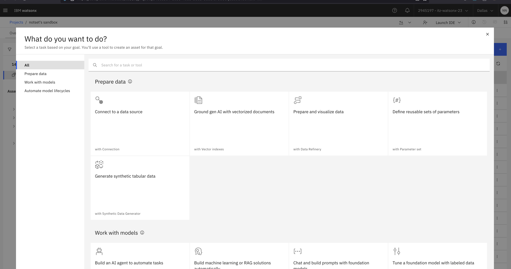

# IBM watsonx.ai Prompt Engineering Lab

This repository contains a Jupyter notebook demonstrating prompt engineering exercises using the `IBM watsonx.ai` foundation models API. 

The notebook includes various prompt engineering exercises using different scenarios:
- Product review analysis
- Multiple perspective summarization
- PII data handling
- Medical record interpretation
- Custom prompt template creation

## What you'll learn:

- Authentication setup with IBM Cloud credentials
- Model parameter configuration
- Foundation model inferencing using WML API
- 10 practical prompt engineering exercises covering:
  - **Task 1:** Sentiment analysis
  - **Task 2:** Emotion extraction
  - **Task 3:** Information extraction
  - **Task 4:** Text summarization
  - **Task 5:** PII removal
  - **Task 6:** Medical data interpretation

### Getting Started

1. To get started, first navigate to the watsonx.ai Project you created in Lab 0.
2. Click the `Assets` tab, click `New Asset`.
3. On the left-hand panel, click `Work with models`:

4. Click `Work with data and models in Python or R notebooks`

5. On the left-hand panel, click `URL` and give the asset a name e.g., `prompt-engineering-lab` and paste the following URL:
   - https://github.com/muqbilk/watsonx-SPE-Lab/blob/main/self-guided-labs/lab-3-prompt-engineering/prompt-engineering.ipynb

6. Click `Create` and wait for the notebook and environment to initialise, this can take a few minutes.

You're now ready to start on the Lab!