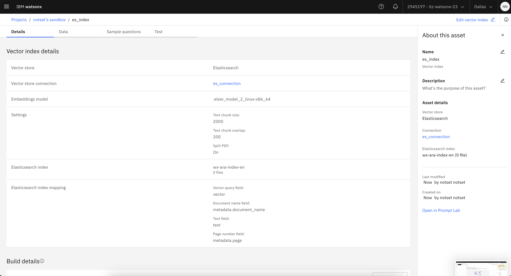

# Retrieval-augmented generation (RAG)

In this Lab you will learn how to implement the retrieval-augmented generation (RAG) pattern using watsonx.ai **Prompt Lab**. 

In the previous Lab [(2) Chat with Documents](../../self-guided-labs/lab-2-chat-with-documents/README.md), we saw how to quickly upload documents to an **in-memory** index and chat with the documents. In this Lab we will be using a dedicated vector store **Elasticsearch**. We will use embedding models to create text embeddings that capture the meaning of a sentence or passage to help with retrieval-augmented generation tasks.

## The workflow:

Retrieval-augmented generation (RAG) is a technique in which a foundation model prompt is augmented with knowledge from external sources. You can use text embeddings to find higher-quality relevant information to include with the prompt to help the foundation model answer factually.

## Supported vector stores

You can use one of the following vector stores to store your grounding documents:
- **In memory**: A Chroma database vector index that is associated with your project and provides temporary vector storage.
    > The in-memory vector index asset is created for you automatically; you don't need to set up the vector store.

- **Elasticsearch**: A third-party vector index that you set up and connect to your project.

- **watsonx.data Milvus**: A third-party vector index that you can set up in watsonx.data, and then connect to your project.

## Supported embedding models

When you upload grounding documents, an embedding model is used to calculate vectors that represent the document text. You can choose the embedding model to use.

For in-memory and Milvus data stores, the following embedding models are supported:
- **all-MiniLM-L6-v2**: Requires a smaller chunk size than the IBM Slate embedding models.
- **slate-30m-english-rtrvr**: IBM model that is faster than the 125m version.
- **slate-125m-english-rtrvr**: IBM model that is more precise than the 30m version. 

### Steps

To quickly test your use case and foundation model, you can use watsonx.ai **Prompt Lab** to chat with the document:

1. From the Prompt Lab select the **Chat mode**, select a foundation model, and then specify any model parameters that you want to use for prompting.

2. Click the **Upload documents** icon, and then choose **Add documents**.

**Elasticsearch** is a distributed, open source search and analytics engine. Data is stored as JSON files in Elasticsearch indexes.

2. Choose the vector store that you want to use. In this Lab we will use the **Elasticsearch** vector store.

3. Name the vector index asset.

Before you can associate an Elasticsearch vector store with a foundation model prompt, you must perform the one-time task of setting up a connection to the Elasticsearch vector store.

4. Click **Create** connection. Give it a *name* and an optional *description*.

> You can find the connection details [here](es_conn.txt).

Enter the `URL`, select the `Shared` credentials settings, select the `Username` and `Password` authentication method and enter the details.

Test the connection.

5. Select the **Embedding model**: *elser_model_2_linux-x86_64* and click **Next**:

In Elasticsearch, `elser` refers to the ELSER *(Elastic Learned Sparse Encoder)* model, which is a sparse embedding model designed for semantic search and retrieval tasks. These models are specifically trained to generate sparse vectors that represent the meaning of text in a way that is optimized for search and relevance ranking.

6. Select **New index**:

7. Give the index a name, add grounding documents in one of the following ways:
    - Add files from a data asset that is associated with your project
    - Browse to upload files from your file system

8. It will take a few minutes to create and configure the chat. Wait for the vector index to be built completely to avoid errors or inaccurate results with the chat.

To inspect the status of the index creation job, close the yellow box showing "Vector index building in progress" and click the `Grounding with documents` icon then click `View vector index details`.

This will show you both the `Vector index details` and the `Build details`. 

9. Once the Job run is successfully you are ready to start using the index.

If there are any issues, or the index creation is taking too long. Click on the `Job details` to inspect the Pod and debug and errors.

Once the index is ready you can chat with your documents.

9. (Optionally), you can create your own index via a Jupyter notebook using the Elasticsearch Python client. And then you can connect watsonx.ai to that index.Here is the full notebook demonstrating this - [semantic search quick start](semantic-search.ipynb). To work with it, upload it to your Project as a Jupyter Notebook asset.

## (Optional) Deploy as an AI service

Once you've completed your testing using Prompt Lab, you're ready to deploy your RAG application using watsonx.ai Service. This is helpful if you want to integrate your RAG app in your wider application. Once deployed you will have an endpoint hosted as a `watsonx.ai Service` ready for inferencing.

1. Click the `Deploy` button on the top navigation bar.
2. Give the AI service a name, e.g. `js-rag-svc`
3. Create a new `Deployment Space` and select it.
4. Click `Deploy`

5. You will see a blue notification to let you know that the deployment is in progress.

6. Monitor the progress of deployment by clicking `View status`. Note: this will navigate away from the page (click leave page).

7. Once deployed successfully, you will two pages; `API reference` page and `Test` page.

- The API reference page will show you the `endpoints` for inferencing and code snippets to help you integrate the service in your wider application, available in various languages.

- The Test page allows you to quickly test the RAG service using a GUI.

-------

## Congrats, you've completed this Lab!