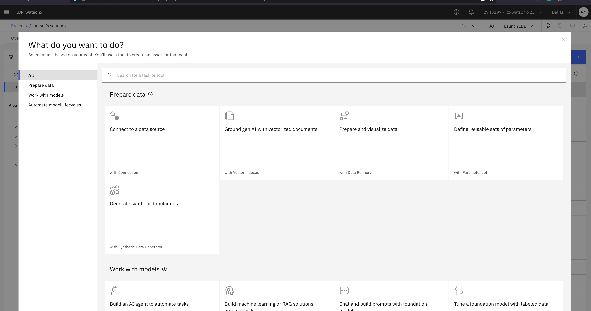

# Intro to LangChain and watsonx.ai Python SDK

In the previous labs, we explored Prompt Lab and also the challenges of prompt engineering; i.e. how important a role the prompt, it's wording and structure, plays in aligning these foundation models to output what we want. We saw how crucial it is to select the right foundation model for the right use-case and tasks and how we can optimize model parameters to achieve specific output objectives.

In this lab, we will apply our new knowledge to a real-world use case as we continue learning about best practices related to prompt coding. Using the [watsonx.ai Python SDK](https://ibm.github.io/watsonx-ai-python-sdk/) to programmatically interact with watsonx.ai, we will use prompt templating techniques provided by the [LangChain Python library](https://python.langchain.com/api_reference/) to streamline our interactions with the language model and maximize its potential.

The concept of Prompt Templates provided by LangChain allows you to construct prompts that can be easily filled with specific information to generate a wide range of outputs that you can provide to watsonx.ai. You can even leverage prompt templates specific to few-shot prompting, as you will see below.

  

### Getting Started
Let's get started and unlock the full potential of Prompt Patterns for generating personalized recommendations at XYZ Retail!

1. To get started, first navigate to the watsonx.ai Project you created in Lab 0.
2. Click the `Assets` tab, click `New Asset`.
3. On the left-hand panel, click `Work with models`:

4. Click `Work with data and models in Python or R notebooks`

5. On the left-hand panel, click `URL` and give the asset a name e.g., `langchain-prompt-template` and paste the following URL:
   - https://github.com/muqbilk/watsonx-SPE-Lab/blob/main/self-guided-labs/lab-5-langchain-intro/langchain-prompt-template.ipynb

6. Click `Create` and wait for the notebook and environment to initialise, this can take a few minutes.

You're now ready to start on the Lab!

