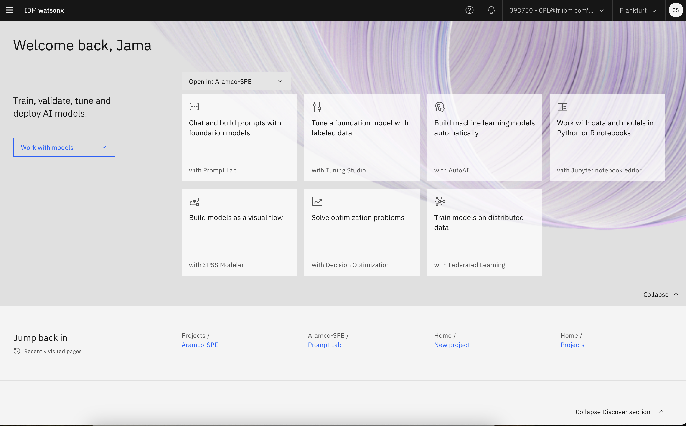
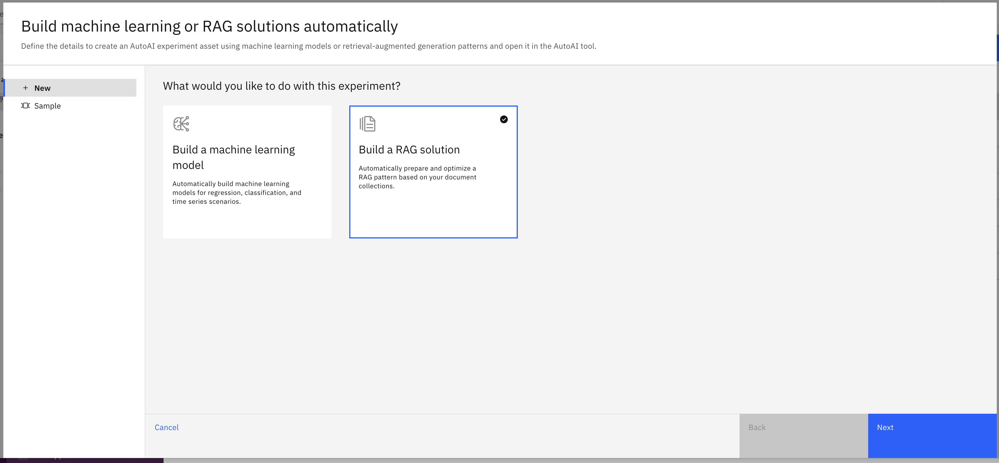
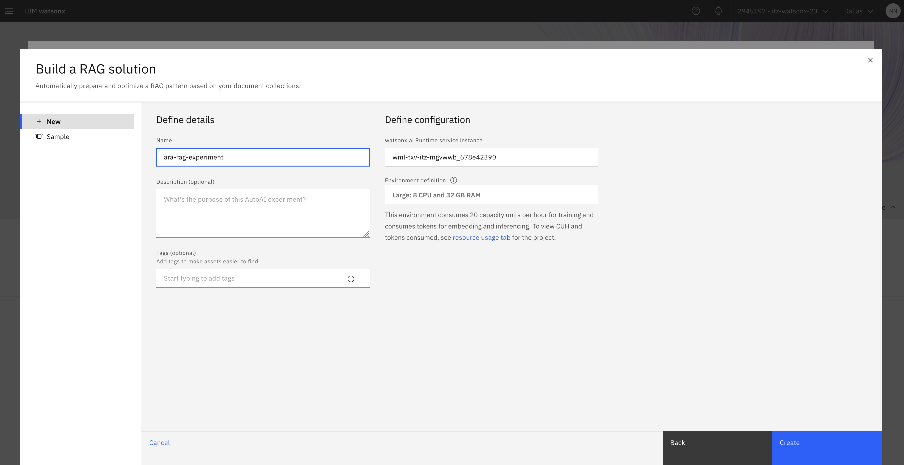
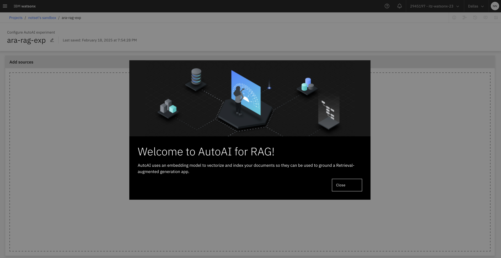
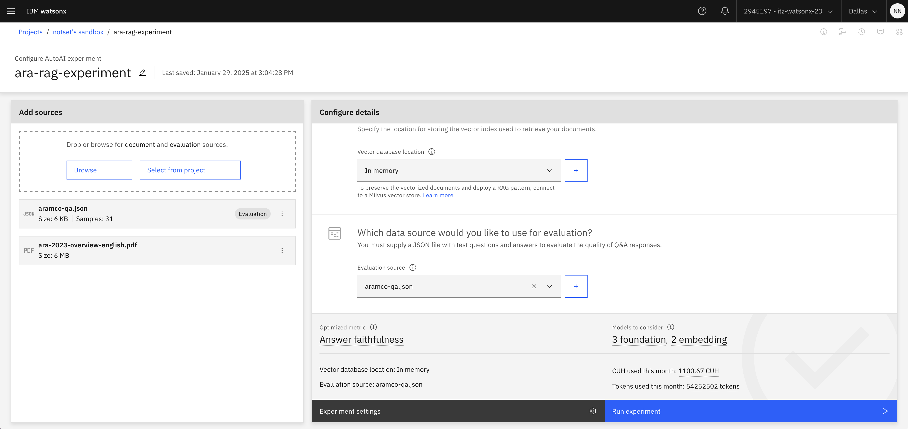
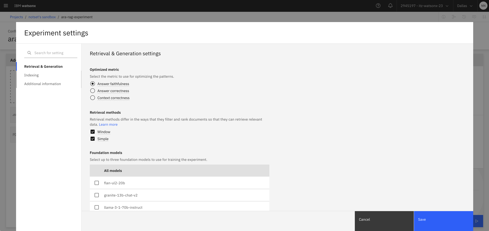
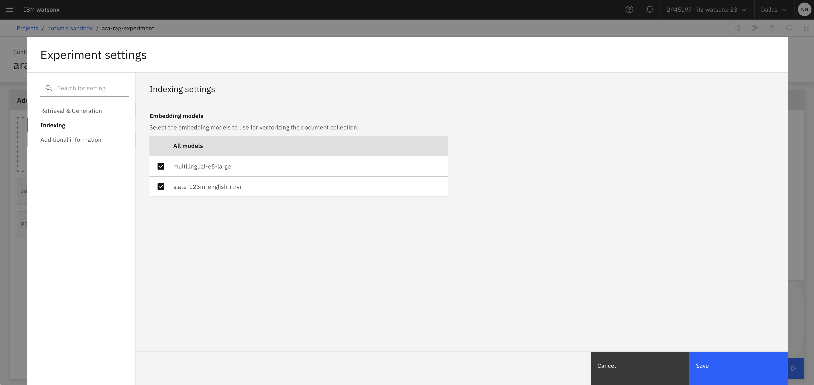
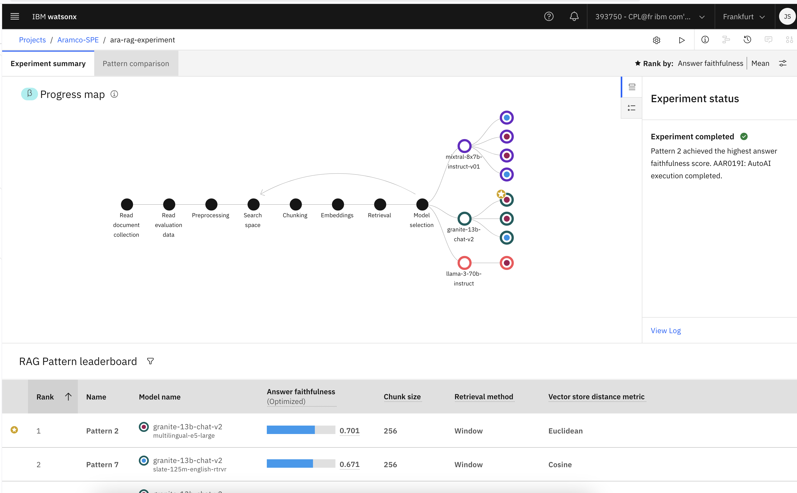
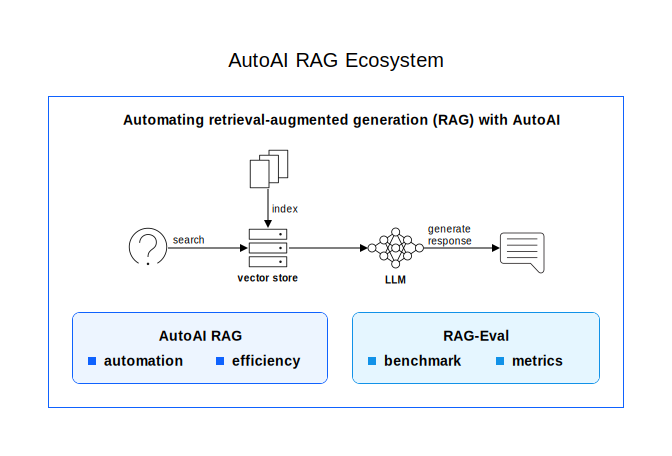
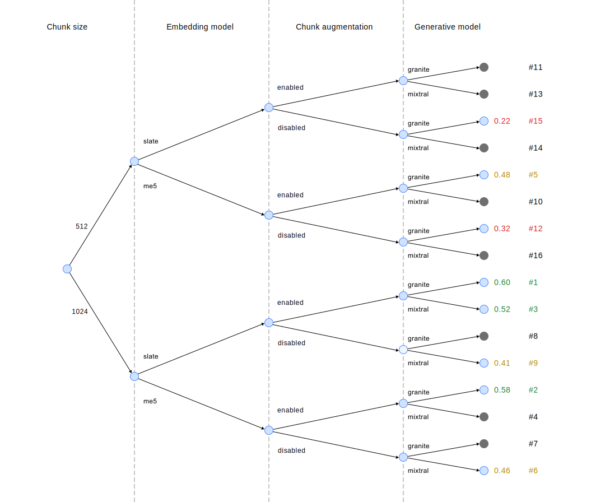

# Building low-code RAG solutions using AutoAI for RAG 

AutoAI is IBM's tool for building and training high-quality predictive models. The AutoAI for RAG capability enables developers to optimize RAG systems quickly and efficiently, identifying optimal combinations while maintaining data quality. The system automatically generates various pipeline configurations, evaluates their performance, and presents the best options via a leaderboard.

In this Lab we will use the **AutoAI for RAG** feature of **watsonx.ai** to automate and accelerate the design and deployment of an optimized, production-quality, Retrieval-augmented generation (RAG) pattern.

## Recap of Retrieval-augmented generation

Retrieval-augmented generation (RAG) combines the generative power of a large language model with the accuracy of a collection of grounding documents. Interaction with a RAG application follows this pattern:

1. A user submits a question to the app.
2. The search first retrieves relevant context from a set of grounding documents.
3. The accompanying large language model generates an answer that includes the relevant information.

## Steps

1.  Select **Building machine learning models automatically `(with AutoAI)`**. If you don't see this option, change the drop down to **Work with models**

2. Select the experiment type: **`Build a RAG solution`** and click **Next**.

3. Give your AutoAI experiment a name, keep the `watsonx.ai Runtime` and `Environment definition` the same and click **Create**.

4. This will launch AutoAI for RAG. You're now ready to automatically build your RAG experiment with AutoAI.

5. Upload both data sets (or select from project space). 

> #### **Important**: The documents you need have been provided in this Repo. You will need to provide both data source (e.g, a source of knowledge for your model) and a benchmark dataset for evaluation. The benchmark dataset contains question and answer pairs to help and guide and align the model in its response and style.

The benchmark dataset should be identified as `Evaluation`. If not, click the three dots and `Select as evaluation source`.

6. Add a vector store, we can select either the **In-Memory** vector store or **Milvus**. In the spirit of rapid experimentation, we will continue with the **In Memory** vector database.

7. Optionally, modify the `Experiment Settings` to tailor to your specific use case.

- Which metric do you want to optimise? The accuracy of the generated response to the retrieved text? Or the correctness of the generated response including both the relevance of the retrieved context and the quality of the generated response? 
- Which Foundation Models do you want to test?
- Which Embeddings models do you want to test? *multilingual-e5-large* or *slate-125m-english-rtrvr*

6. Explore the *Experiments* to see which one achieved the highest metric.

7. (Optionally) To preserve the vectorized documents and deploy a RAG pattern you'll need to [connect to a Milvus vector store](https://eu-de.dataplatform.cloud.ibm.com/docs/content/wsj/analyze-data/fm-prompt-data-index-milvus.html?context=wx).

## (Further Reading) Automating the search for the best RAG configuration

RAG comes with many configuration parameters, including which large language model to choose, how to chunk the grounding documents, and how many documents to retrieve. Configuration choices that work well for another use case might not be the best choice for your data. To create the best possible RAG pattern for your dataset, you'd want to explore all the possible combinations of RAG configuration options to find, evaluate, and deploy the best solution. 

This part of the process can require a significant investment of time and resources. Just as you can use AutoAI to rapidly train and optimize machine learning models, you can use AutoAI capabilities to automate the search for the optimal RAG solution based on your data and use case. Accelerating the experimentation can dramatically reduce the time to production.

**Key features of the AutoAI approach include:**

- Full exploration and evaluation of a constrained set of configuration options​.
- ​Rapidly reevaluate and modify the configuration when something changes​. For example, you can easily re-run the training process when a new model is available or when evaluation results signal a change in the quality of responses.

Using AutoAI automates the end-to-end flow from experimentation to deployment. The following diagram illustrates the AutoAI approach to finding an optimized RAG pattern for your data and use case in 3 layers:

- At the base level are parameterized RAG pipelines that are used to populate a vector store (index) and to retrieve data from the vector store to use when the large language model generates responses.
- Next, RAG evaluation metrics and benchmarking tools evaluate response quality.
- Finally, a hyper-parameter optimization algorithm searches for the best possible RAG configuration for your data.

### How does the optimisation process work?

Running experiments by using AutoAI RAG avoids testing all RAG configuration options (for example, it avoids a grid search) by using a hyper-parameter optimization algorithm. The following diagram shows a subset of the RAG configuration search space with 16 RAG patterns to choose from. If the experiment evaluates them all, they are ranked 1 to 16, with the highest-ranking three configurations tagged as best performing. The optimization algorithm determines which subset of the RAG patterns to evaluate and stops processing the others, which are shown in gray. This process avoids exploring an exponential search space while still selecting better-performing RAG patterns in practice.

## Congrats, you've completed this Lab!