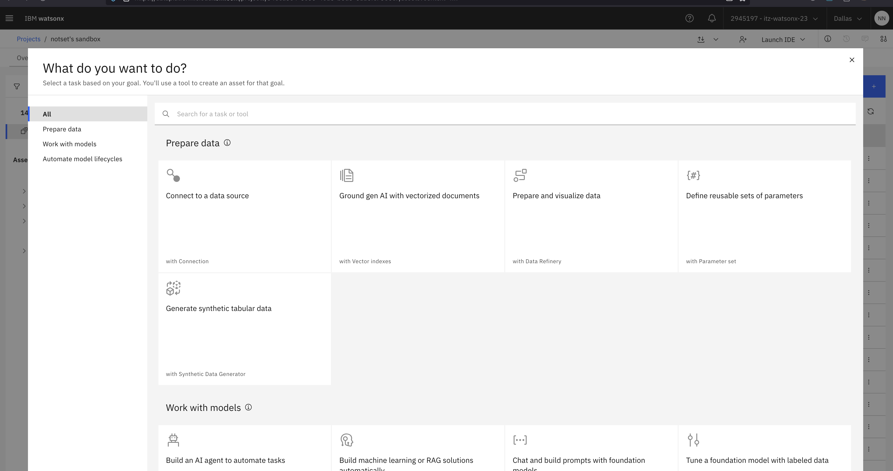
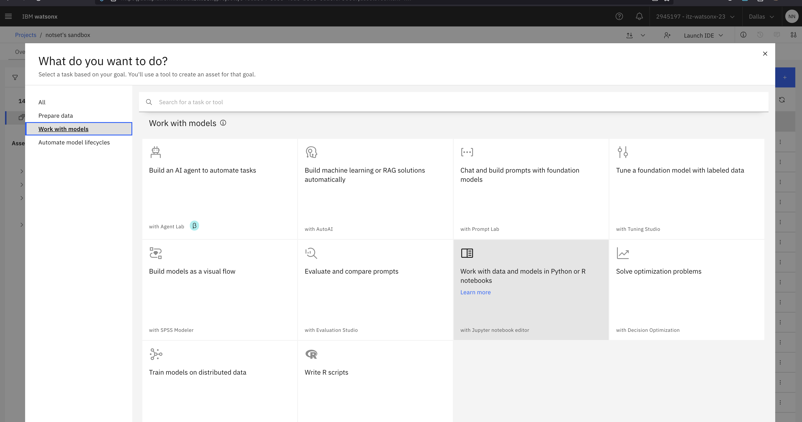

## Using the watsonx.ai Time Series Forecasting API to predict energy demand

### IBM watsonx.ai Timeseries Forecasting API and SDK 

We are pleased to announce that the IBM® watsonx.ai™ Timeseries Forecasting API and SDK is available to the public in GA from February 2025. Built on the IBM [Granite™ timeseries models](https://www.ibm.com/granite), this new API/SDK offers unparalleled accuracy and ease of use for tackling real-world forecasting challenges. At the core of this capability is the IBM Granite timeseries models (TinyTimeMixers), a family of open source pretrained, lightweight models based on a novel architecture.

[IBM Granite Time Series models](https://arxiv.org/pdf/2401.03955) are designed to:

- **Adapt to diverse datasets:** Whether it’s IoT sensor data, stock market prices, or energy demand, Granite dynamically adjusts to data irregularities, seasonality, and trends, allowing for zero-shot forecasting.

- **Deliver state-of-the-art accuracy:** Granite timeseries models outperform many larger timeseries models like TimesFM, Moirai, Chronos, and more that are 10x the size on various industry benchmarks, while being computationally efficient.

- **Support scalability:** From small-scale business needs to enterprise-grade implementations, the models handle forecasting at any scale.

 These models are trained on a collection of publicly available datasets which permit commercial use. A total of 700 Million timepoints were used from selected datasets from the [Monash Forecasting Repository](https://openreview.net/pdf?id=wEc1mgAjU-) and the [LOTSA](https://arxiv.org/abs/2402.02592) collection. Granite timeseries models currently support multiple input context lengths (512, 1024, and 1536 data points), and are capable of multivariate predictions across a number of channels and IDs. For more information about use cases and training details, see the [model card](https://huggingface.co/ibm-granite/granite-timeseries-ttm-r2) and the IBM Research [paper](https://arxiv.org/pdf/2401.03955).

### Getting Started
Let's get started
### Here is the [Jupyter notebook](./time-series-data.ipynb) for this Lab

1. To get started, first navigate to the watsonx.ai Project you created in Lab 0.
2. Click the `Assets` tab, click `New Asset`.
3. On the left-hand panel, click `Work with models`:

4. Click `Work with data and models in Python or R notebooks`

5. On the left-hand panel, click `URL` and give the asset a name e.g., `time-series-data` and paste the following URL:
   - https://github.ibm.com/jama/Aramco-SPE-Hands-on-Labs/blob/main/self-guided-labs/lab-7-time-series-data/time-series-data.ipynb

6. Click `Create` and wait for the notebook and environment to initialise, this can take a few minutes.

You're now ready to start on the Lab!
