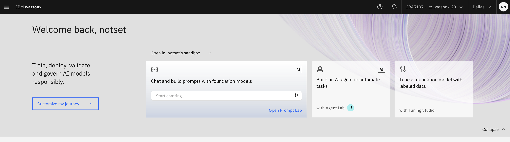
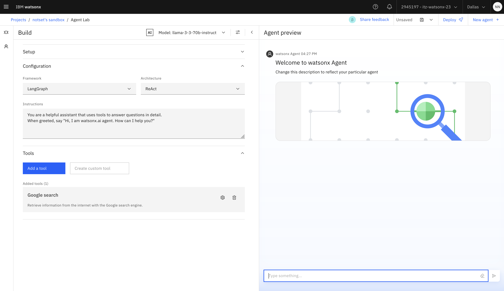
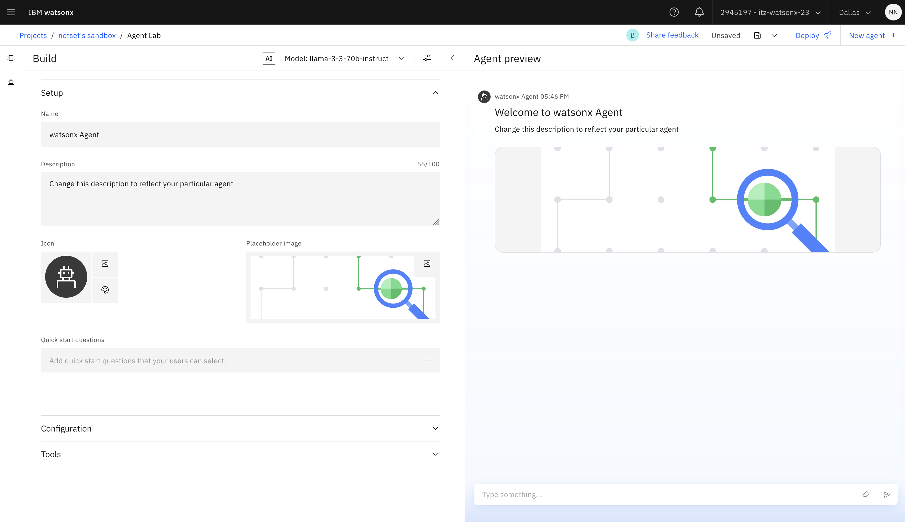
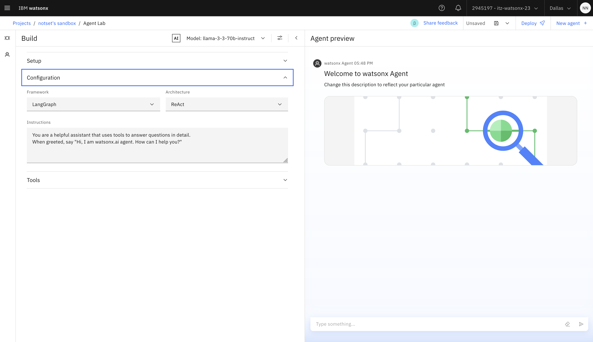
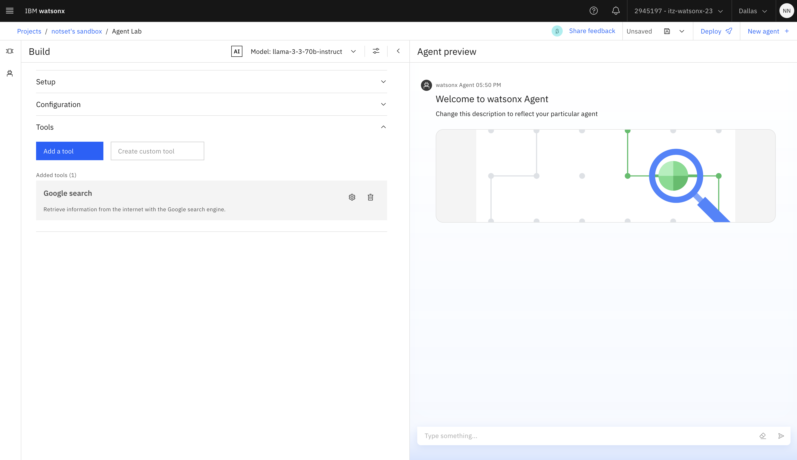
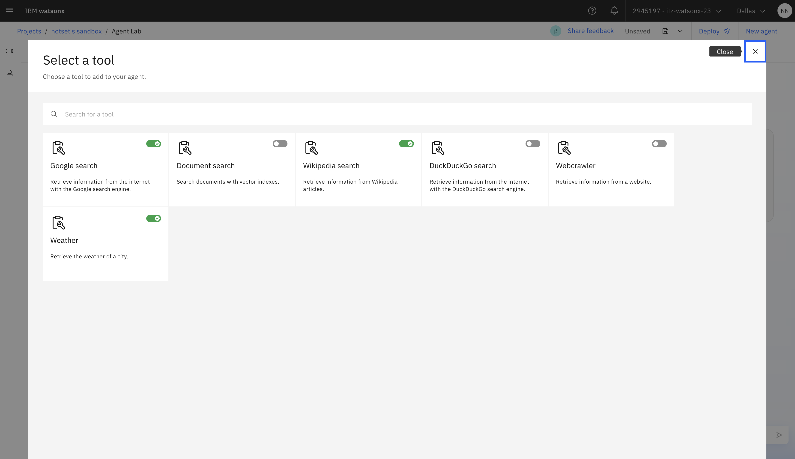
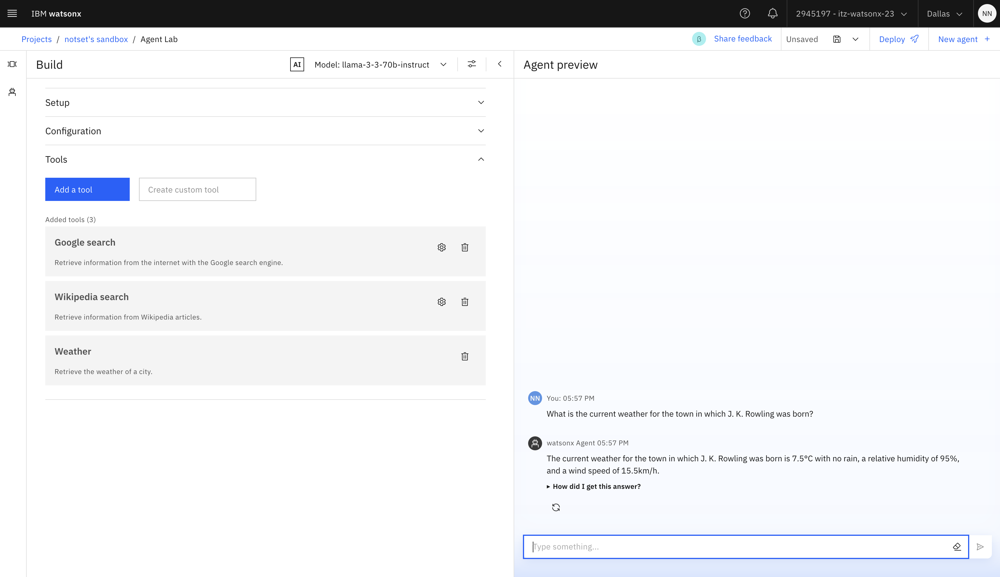
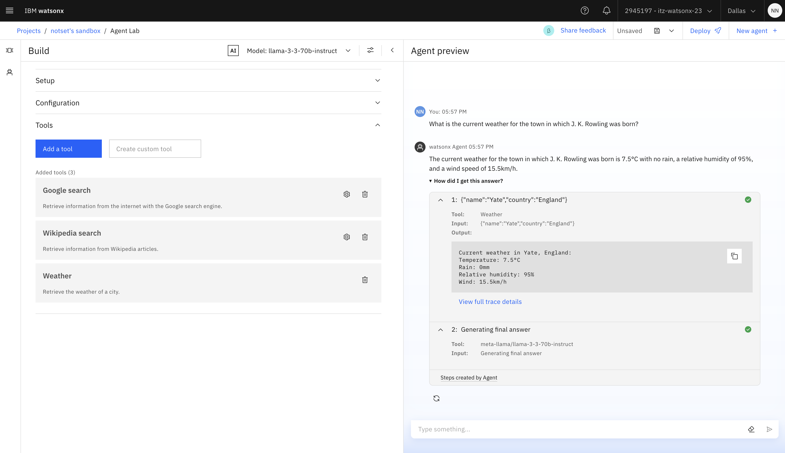

## IBM watsonx.ai Agent Lab

Welcome to the Agent Builder Lab! 

The Agent Lab in IBM watsonx.ai is a **low-code developer tool for building agentic services**. This Lab will show you how to build and deploy AI Agents that can be used to make your applications more flexible and dynamic.

> Note: The Agent Lab tool in watsonx.ai is available as a beta feature.

### Getting started with Agent Lab

1. Navigate to the IBM watsonx.ai Homepage, and select `with Agent Lab` under '*Build an AI agent to automate tasks*':



2. This will launch the Agent Builder page. 

The **Agent Lab** lets you easily build and customize your AI agent with minimal coding. You define the parameters of the interaction between the agent and the end user, including the **foundation model**, **framework**, **architecture**, and **tools** that the agent uses to accomplish a task.

In a real-world scenario, the agent takes the next best step based on the current state of the interaction. The foundation model within the agent picks one or several external or custom tools based on the prompts submitted by the end user. The agent framework then uses a process called *tool calling*, which is also referred to as *function calling*, to search for information from multiple sources and generate a response.

```
For example, a flight reservation tool might need to collect the following information, and then create a reservation:

- Source and destination locations
- Number of passengers
- Travel date
- Price range
```

The order in which the information is collected might matter for some flights, where the number of available seats is limited, or where the prices are within the requested range. The agent processes all the user inputs and the underlying foundation model determines when to call additional tools, such as a search engine that finds an airline that provides frequent service between the source and destination locations, before the agent completes a reservation request.

#### Agent Builder UI


### Building an agent to automate generative AI tasks

3. Select a **foundation model** and optionally update model parameters. For details, see the **Foundation Model Library** to see which models are available for tool/function calling. Click the `Model` drop down -> `View all foundation models`.

When you build an agentic workflow, choose a foundation model that meets the following requirements:

- Handles chat tasks
- Supports tool calling
- Responds well to chain-of-thought prompting techniques and chooses the next action
- Has a good performance on reasoning benchmarks

See [here](https://www.ibm.com/docs/en/watsonx/saas?topic=solutions-agent-lab-beta#model) for more info.


4. Expand the `Setup` drop down to set up your agent, specify a name for the agent and describe the tasks the agent performs.



5. *Optional*: Select an icon and background image to customize how your agent appears in the Agent Preview pane.

6. Expand the `Configure` drop down to select the AI agent framework you want to use to create, deploy and, manage your agent.

> Note: Currently, watsonx.ai offers LangGraph as the only framework choice.

7. Select the architecture that implements agentic AI reasoning.

> Note: Currently, watsonx.ai offers ReAct as the only architecture choice.

8. Define specific instructions for your agent that is used to create a system prompt for the selected foundation model. The instructions can include using a specific language, date or time format, user greeting, or an external tool as an information source instead of a foundation model's knowledge base.



9. Expand the `Tools` drop down to configure one or more external tools. Click `Add a tool`.



10. Add tools that the agent framework can invoke to compose a response. Select tools from a list of provided tools or create your own custom tool. For details, see [Tools configuration](https://www.ibm.com/docs/en/watsonx/saas?topic=solutions-agent-lab-beta#tools).

In this example we select the following additonal tools:
- Wikipedia Search (max_results=5)
- Weather API



11. Test your agent in the Agent preview pane to make sure the agent generates the correct result by using a combination of the foundation model and the relevant tools.




12. To preserve your work so that you can reuse or share an agent with collaborators in the current project, save your work as a project asset. For details, see [Saving agents](https://www.ibm.com/docs/en/SSYOK8/wsj/analyze-data/fm-agent-save.html). Alternatively, you can deploy your agent as an AI service in a deployment space. For details, see [Deploying AI services with tools](https://www.ibm.com/docs/en/SSYOK8/wsj/analyze-data/ai-services-tools.html).

For details about an alternative method to build agentic chat workflows by using the watsonx.ai REST API, see [Building agent-driven workflows with the chat API](https://www.ibm.com/docs/en/SSYOK8/wsj/analyze-data/fm-api-chat-tools.html).